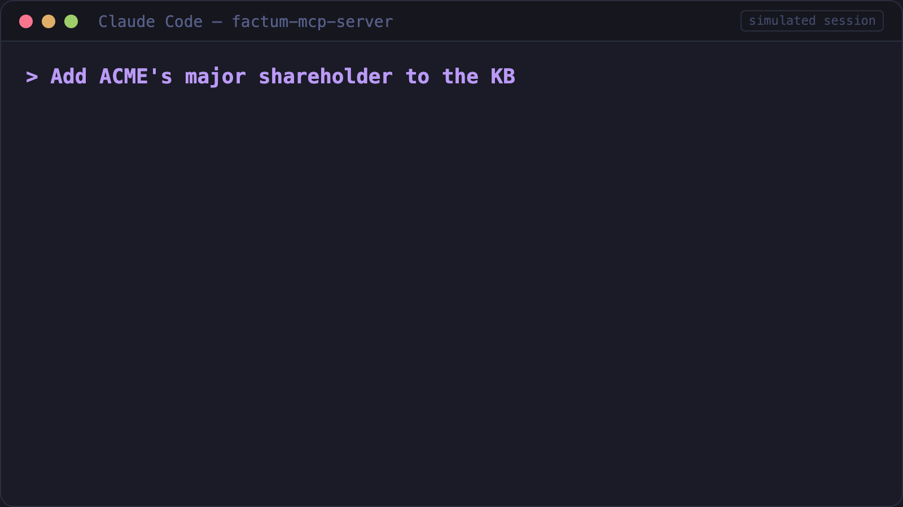

# Factum — Auditable Memory for AI Agents

> **Status: v0.1.0 — Early stage, seeking early collaborators.**
> Core write/query/retract pipeline works. Not production-ready. Architectural decisions are still open to change.




> **[Interactive docs](https://factum-project.github.io/factum/)** — animated syntax parsing, 7-tuple explorer, query pipeline, token efficiency chart, and MCP architecture diagram.

Every fact an agent writes carries mandatory provenance. When a source is retracted, everything derived from it is invalidated automatically — cascade retraction. When facts conflict, Factum returns `Ambiguous` instead of guessing.

A structured knowledge language (S-expression based), Rust implementation, stdio MCP server — works with Claude Code, Cursor, and any MCP client.

**Status: v0.1.0, early stage.** Core write/query/retract pipeline works; no semantic search or memory consolidation yet — Factum handles verified structured facts, not conversation context. Best suited for compliance-sensitive agents, multi-agent shared knowledge bases, and anywhere "why did the agent believe X" needs an answer.

## How is this different from Mem0 / Zep / Letta?

**Unique to Factum:** grammar-enforced provenance · cascade retraction · conflict refusal.

**Not (yet) in Factum:** embedding-based semantic retrieval · memory consolidation · HTTP transport.

Complementary: Mem0/Letta store and retrieve context; Factum stores auditable structured facts. They can run side by side via MCP.

### What this means in practice

| Agent memory pain point | Factum mechanism |
|------------------------|------------------|
| Can't tell "user said" from "LLM inferred" | 5-level provenance + grammar-enforced model name on Extracted nodes |
| Stale memory used as current fact | Soft delete + cascade retraction via reverse dependency graph |
| Conflicting memories silently pick one | `Ambiguous` — refuses to answer rather than guess |
| Memory pollution (prompt injection) | Provenance chain makes contamination traceable and retractable |
| Enterprise can't let agents store sensitive data | Index-level permission filtering — no post-query leakage |

> **Academic context:** The [STALE benchmark](https://arxiv.org/abs/2605.06527) (2025) shows that even the best LLM agents achieve only 55.2% accuracy at detecting when their own memories are outdated — confirming that memory staleness is an unsolved problem in agent systems.

## Key Features (Implemented)

- **Node 7-tuple**: Every knowledge node carries id, predicate, validity, provenance, confidence, authority, and permissions
- **5-level provenance**: Verbatim / Summary / Extracted / Derived / Asserted — full audit chain
- **Grammar-enforced model reference**: `Extracted` nodes MUST carry model + version — the parser rejects them if missing (not just a documentation convention)
- **Cascade retraction**: Derived nodes auto-invalidate when upstream sources are retracted (via `deps_rev` reverse dependency graph)
- **Conflict arbitration**: LatestWins / HighestAuthority / Unanimous — returns `Ambiguous` when it cannot uniquely resolve
- **Index-level permissions**: No post-query filtering — prevents aggregate leakage
- **Lossless numerics**: All numbers use `Dec(i128, u8)` — zero floating-point error
- **MCP bridge**: JSON-RPC 2.0 tools/resources; **stdio transport verified** with real MCP clients (Claude Code, Cursor)

## What's Implemented vs. What's Not

| Module | Status | Notes |
|--------|--------|-------|
| factum-core (types, lexer, parser, serialize) | ✅ Implemented | 100% syntactic round-trip |
| factum-rt (store, query, arbitration, permissions, verifiers) | ✅ Implemented | In-memory store (default) + **RocksDB persistence** (`--features rocksdb`); 5 column families, WriteBatch atomic writes |
| factum-mcp (JSON-RPC bridge) | ✅ Protocol + handler | **stdio transport verified** end-to-end; HTTP transport not yet implemented (remote deployment requires custom wrapper) |
| factum-bench (benchmarks) | ✅ Implemented | Syntax round-trip + token efficiency + query perf |
| factum-l (latent space projection) | ❌ Not started | Research item — see ROADMAP.md |
| Wikidata/Mathlib corpus converters | ❌ Not started | M2 milestone |
| Lean/Z3 verifiers | ❌ Not started | Only Schema + DecimalRange verifiers implemented |
| Embedding-based semantic search | ❌ Not started | Not on roadmap — consider using Mem0 alongside Factum |
| Memory consolidation/summarization | ❌ Not started | Not on roadmap — consider using Letta alongside Factum |
| Inspector (visual debugger) | ❌ Not started | |

## Quick Start

```bash
# Build
cargo build

# Run tests
cargo test

# Run demo
cargo run -p factum-demo

# Build with RocksDB persistence backend
cargo build --features rocksdb
cargo test --features rocksdb

# Fuzz (requires nightly)
cargo +nightly fuzz run fuzz_parser -- -max_total_time=600
```

### Use as an MCP server (Claude Code / Cursor)

```bash
# Build the MCP server binary
cargo build --release -p factum-mcp --bin factum-mcp-server

# Register with Claude Code
claude mcp add --transport stdio --scope local factum -- "$(pwd)/target/release/factum-mcp-server"

# Verify connection
claude mcp get factum
```

See [Getting Started with Factum MCP](docs/getting-started-mcp.md) for the full guide.

## Factum-F Syntax Example

```scheme
; Acme Corp knowledge graph
(node n001
  :pred (instance-of @ACME-CORP organization)
  :conf 0.99 :auth 0.95 :perm public
  :src (asserted "wikidata"))

(node n004
  :pred (shareholder-major @ACME-CORP @FOUNDER-1 0.73 :since #date(2001-03-15))
  :conf 0.85 :auth 0.8 :perm confidential
  :src (extracted "doc002" [100 200] (model "claude-sonnet-4" "2025-01")))

(node n006
  :pred (subsidiary-of @ACME-SUB @ACME-CORP :since #date(2001-03-15))
  :src (derived n001 "rule-subsidiary-merge")
  :deps [n001])
```

When n001 is retracted, n006 is automatically invalidated — the agent knows it can no longer trust the subsidiary relationship.

## Three-Layer Architecture

| Layer | What It Means | Status |
|-------|--------------|--------|
| **Agent Read** | Agent receives Factum-F as context via MCP — lower token overhead than verbose JSON | ✅ Token efficiency measured (real o200k_base: canonical −62%, compact −53% vs JSON) |
| **Agent Write** | Agent generates Factum-F nodes — parse uniqueness guarantees one valid interpretation, error classes enable self-correction | ✅ See [authoring guide](docs/authoring-for-llms.md) |
| **Latent Reasoning** | factum-l: encode Factum-F into continuous thought vector, reason in latent space, decode back for audit | 🔬 Research item — not started, not blocking layers 1-2 |

A structured knowledge language underpins the memory layer — S-expression based for parse uniqueness, with `Dec(i128, u8)` for lossless numerics and mandatory model references for LLM self-auditing. Full design rationale in [docs/design-rationale.md](docs/design-rationale.md).

## Token Efficiency — The LLM-Native Metric

> **TL;DR: Factum canonical form saves ~62% tokens vs verbose JSON with the same metadata. All numbers measured with real o200k_base (GPT-4o) tokenizer via tiktoken-rs.**

| Format | Real tokens (5 nodes) | vs verbose JSON | What it includes |
|--------|-----------------------|-----------------|------------------|
| Factum canonical | 238 | **−62%** | Full 7-tuple: provenance + confidence + validity + permissions |
| Factum compact (JSON) | 290 | −53% | Same 7-tuple, JSON with numeric tags |
| Markdown | 181 | −71% | Assertion text only — **no provenance, no confidence, no permissions** |
| JSON (pretty) | 623 | baseline | Same 7-tuple metadata in verbose JSON encoding |

> Run `cargo test -p factum-bench test_token_efficiency_real_tokenizer -- --nocapture` to reproduce.

**Key finding**: The canonical S-expression form (238 tokens) is more token-efficient than the compact JSON form (290 tokens) — BPE tokenizers split JSON delimiters but merge S-expression parentheses. The form designed for correctness is also the most token-efficient.

## Round-Trip Fidelity — What Exactly Is 100%?

1. **Syntactic round-trip** ✅ — `parse(serialize(parse(x))) == parse(x)`. **100% and verified by the test suite + fuzzing.** This is the trust foundation.

2. **Semantic round-trip** ❌ Not yet measured — requires factum-l (latent space projection, not implemented).

## Morpheme Vocabulary — Current State

- **Seed morphemes**: 24 (covering common entity types, relations, quantifiers, modals, and temporal operators)
- **Design target**: 200–500 (to be loaded from `morphemes.toml` via `build.rs`)
- **Gap**: The current 24 seed morphemes are sufficient for testing the architecture but **not sufficient for production use**. Expanding the vocabulary is a pre-M2 requirement.

## Relationship to Other Formats

| Format | How Factum Differs |
|--------|-------------------|
| **RDF / JSON-LD** | RDF triples carry no per-node provenance, confidence, or permissions. Factum makes these first-class and non-optional. |
| **Markdown** | Markdown has zero metadata. Factum trades human readability for machine verifiability. |
| **JSON** | JSON has no schema, no provenance, no temporal validity. Factum compact form uses JSON as transport but adds structure and audit chain. |
| **Mem0 / Zep / Letta** | These store and retrieve agent memory. Factum adds grammar-enforced provenance, cascade retraction, and conflict refusal. Complementary, not competitive. |

## Project Structure

```
factum/
├── crates/
│   ├── factum-core/     # Data model, lexer, parser, serialization
│   ├── factum-rt/       # Runtime: store (InMemory + RocksDB), query, arbitration, permissions, verifiers
│   ├── factum-mcp/      # MCP bridge: JSON-RPC tools/resources, stdio transport
│   ├── factum-bench/    # Benchmarks: round-trip, token efficiency, query perf
│   └── factum-demo/     # End-to-end demonstration
├── fuzz/              # cargo-fuzz targets (parser, serialize round-trip, lexer)
├── spec/              # Conformance test vectors (JSON, language-agnostic)
├── docs/site/         # Interactive visualization (GitHub Pages)
├── .github/workflows/ # CI: test + fuzz + gitleaks + Pages deploy
├── Cargo.toml         # Workspace root
├── ROADMAP.md         # What's planned and in what order
├── SECURITY.md        # Vulnerability disclosure
├── CONTRIBUTING.md    # How to contribute
├── CHANGELOG.md       # Version history
├── docs/design-rationale.md     # Why each architectural decision was made
├── docs/authoring-for-llms.md   # LLM guide for generating Factum-F
└── docs/getting-started-mcp.md  # MCP setup guide (Claude Code / Cursor)
```

## Test Results

Run `cargo test` to see the current count. Tests cover: types, lexer, parser, serialization, morphemes, depth-limit/DoS protection, conformance vectors, store, query, arbitration, permission, verifier, subscription, MCP protocol/tools/handler, and benchmarks.

CI badge at the top of this README reflects the latest build status.

## Security

- Parser has a **depth limit** (128 levels) to prevent stack overflow DoS on adversarial input
- Lexer has a **token count limit** (1M tokens) to prevent OOM
- **cargo-fuzz** targets for parser, serialize round-trip, and lexer
- **gitleaks** runs in CI to scan for leaked secrets

See [SECURITY.md](SECURITY.md) for vulnerability disclosure.

## License

MIT

## Trademark

"Factum" and the Factum-F language specification are project names. This MIT license covers code only; the specification may be governed by a separate process in the future.

## Contributing

Contributions require **DCO sign-off** (`git commit -s`). See [CONTRIBUTING.md](CONTRIBUTING.md).

---

- MCP Registry name: `mcp-name: io.github.factum-project/factum`
